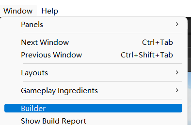

# UnityUtil
一些Unity常用工具合集，直接上代码

# 基础
基于Unity2020 Urp管线；因为URP和HDRP已稳定，遂不在支持多版本，只使用支持手游的URP

引用库
1. Cinemachine  -   因为经常想做运镜和镜头语言，所以就顺手引入
2. Universal RP

# 目录
## Assets/BigWorld
开发世界 - 地图处理

v0.5,现在还是有bug，是缺了一些依赖库，暂时还不想引入这些库，/BigWorld这个目录可屏蔽
## Assets/BuilderAutoHelper

有jetkens等自动构建工具，为什么还要一个本地构建呢？

1.因为这是一个本地构建，这是一个本地构建，这是一个本地构建，重要事情说3遍

2.在开发自动构建时，可参考这份“本地”已通过实践证明的代码

v0.3 - 修复了Unity2020及以后版本的BuildOptions差异，可支持Auto Build Player选项(Build and Play)
## ECS
1
## Camera和Input
坦克操作

飞机操作

人物操作

## Stage场景
阳光海滩

射灯舞台

Kerry老师的星空球

太空舰

车展览厅

